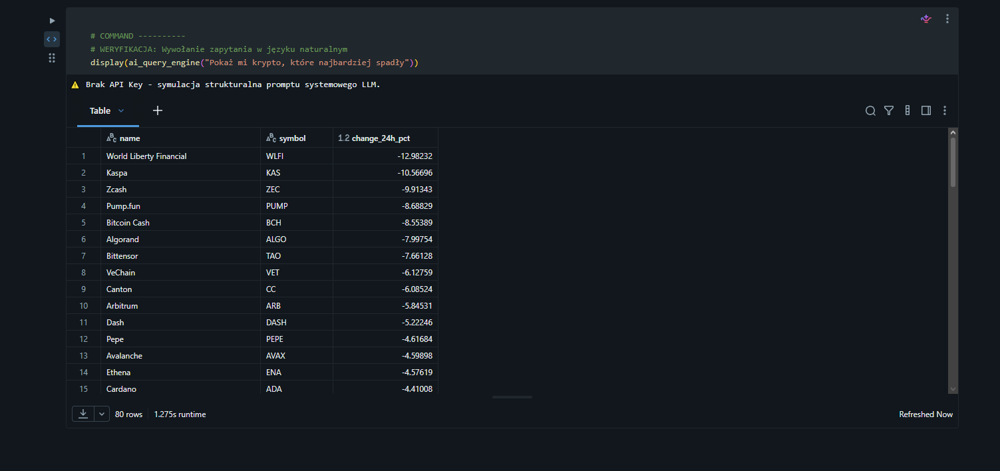

# End-to-End Cloud Data & AI Engine (GCP + Databricks + PySpark)

## 📊 Pipeline Execution & AI Query Demo


An enterprise-grade Lakehouse data pipeline and natural language query engine for crypto market analytics, built on GCP Storage and Databricks Delta Lake.

## 🏗️ Architecture
```mermaid
graph TD
    A[CoinGecko API] -->|Python Ingestion| B[GCP Cloud Storage - Raw JSON]
    B -->|PySpark Reader| C[Bronze Layer - Raw Data]
    C -->|Schema Enforcement & Cleansing| D[Silver Layer - Delta Lake]
    D -->|Sentiment & Market Aggregation| E[Gold Layer - Delta Lake]
    E -->|Natural Language Prompt| F[Text-to-SQL AI Engine]
